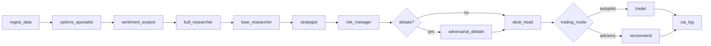

This document is the **contract** for the LangGraph pipeline: responsibilities, state interfaces, prompts, and guardrails.

**Graph wiring** lives in `agents/graph.py` (see `build_graph()` + routing functions).

---

### The graph, visually



---

### Interface rules (applies to every node)

Nodes take a `FirmState` and return a `FirmState`. Communication is via **field mutation**.

| Mechanism | Location | Purpose |
|---|---|---|
| State model | `agents/state.py` | strongly-typed shared state |
| Audit trail | `FirmState.reasoning_log` (`ReasoningEntry`) | human-readable, in-memory |
| Durable audit | SQLite (`cache/app.sqlite3`, `xai_log`) | persistent, queryable |
| Interactive flow | MLflow (optional) | nested runs per step |

LLM nodes must output **strict JSON**; the code validates and runs a single repair pass if needed.

---

## Node specs

### `ingest_data` (deterministic)

**Responsibility**: deterministic feature engineering + option-chain filtering. No LLM calls.

**Implementation**: `agents/graph.py` (`ingest_data_node`)

**State interface**

| Reads | Writes |
|---|---|
| `ticker`, `underlying_price`, raw-ish `latest_greeks`, `news_feed` | filtered `latest_greeks`, `market_regime`, IV analytics fields, `tier3_structured_digests` |

**Guardrails**

Option contracts are filtered via `agents/data/options_chain_filter.py` before any LLM sees them:

- expiry must be **>= today**
- DTE must be **<= `AGENT_OPTIONS_MAX_DTE_DAYS`** (default ~60)
- strike windows are asymmetric (calls: spot→+band, puts: −band→spot)

**Observability**

- Appends deterministic metrics to debug logs
- MLflow child run (when enabled) logs counts + IV regime/skew + duration

---

### `options_specialist` (LLM)

**Responsibility**: interpret the IV surface and return a structured go/no‑go with one concrete structural opportunity.

**Implementation**: `agents/agents/options_specialist.py`

**State interface**

| Reads | Writes |
|---|---|
| filtered `latest_greeks`, `underlying_price`, `market_regime`, portfolio greeks | `analyst_decision`, `analyst_confidence`, IV fields, `ReasoningEntry` |

**Guardrails**

- strict JSON schema validation (+ repair pass)

<details>
<summary><b>System prompt (source: <code>agents/agents/options_specialist.py</code>)</b></summary>

```text
ROLE: OptionsSpecialist (Volatility Surface / Structure)
...
Output STRICT JSON:
{
  "decision":      "PROCEED" | "HOLD" | "ABORT",
  "iv_regime":     "LOW" | "NORMAL" | "ELEVATED" | "EXTREME",
  "skew_signal":   "PUT_PREMIUM" | "CALL_PREMIUM" | "NEUTRAL",
  "term_signal":   "CONTANGO" | "BACKWARDATION" | "FLAT",
  "opportunity":   "<specific structure or null>",
  "preferred_dte_bucket": "<e.g. '21-45d'>",
  "confidence":    0.0-1.0,
  "reasoning":     "<3-5 sentences>"
}
```
</details>

**Observability**

- ReasoningEntry: inputs include IV metrics; outputs include confidence + opportunity
- MLflow child run: `inputs.json`, `outputs.json`, `duration_s`

---

### `sentiment_analyst` (LLM)

**Responsibility**: convert recent headlines into a calibrated sentiment signal with explicit themes/risks.

**Implementation**: `agents/agents/sentiment_analyst.py`

**State interface**

| Reads | Writes |
|---|---|
| `news_feed` (lookback window), Tier‑1 monitor score/source | `aggregate_sentiment`, `sentiment_*` fields, `ReasoningEntry` |

**Guardrails**

- headline timestamp coercion (avoid naive/aware datetime issues)
- strict JSON schema validation (+ repair pass)

<details>
<summary><b>System prompt (source: <code>agents/agents/sentiment_analyst.py</code>)</b></summary>

```text
You are a buy-side financial sentiment analyst...
Output STRICT JSON:
{
  "decision":            "PROCEED" | "HOLD" | "ABORT",
  "aggregate_sentiment": -1.0 to +1.0,
  "weighted_sentiment":  -1.0 to +1.0,
  "headline_scores": [{"text":"...","score":-1..1,"weight":0..1}],
  "key_themes": ["<theme>"],
  "tail_risks": ["<risk>"],
  "catalyst_detected": true | false,
  "confidence": 0.0-1.0,
  "reasoning": "<3-4 sentences>"
}
```
</details>

---

### `bull_researcher` / `bear_researcher` (LLM)

**Responsibility**: generate a bull case and bear case plus conviction scores (1–10).

**Implementation**: researcher nodes in `agents/graph.py`

**State interface**

| Reads | Writes |
|---|---|
| small market + sentiment context slice | `bull_argument`, `bull_conviction`, `bear_argument`, `bear_conviction`, `ReasoningEntry` |

---

### `strategist` (LLM → structured proposal)

**Responsibility**: choose a single strategy and assemble a concrete `TradeProposal`.

**Implementation**: `agents/agents/strategist.py`

**State interface**

| Reads | Writes |
|---|---|
| chain analytics (`near_atm_contracts`), sizing, sentiment/regime | `pending_proposal`, `strategy_confidence`, `ReasoningEntry` |

**Guardrails**

1. **Grounding**: only OCC symbols in `near_atm_contracts`.
2. **Expiry**: any expired leg downgrades to HOLD (proposal rejected).

<details>
<summary><b>System prompt (source: <code>agents/agents/strategist.py</code>)</b></summary>

```text
ROLE: Strategist (Strategy selection + proposal assembly)
...
Output STRICT JSON (HOLD or PROCEED schema)
```
</details>

---

### `risk_manager` (hard gates + LLM soft check)

**Responsibility**: prevent capital destruction; enforce hard limits before any optimistic synthesis.

**Implementation**: `agents/agents/risk_manager.py`

**State interface**

| Reads | Writes |
|---|---|
| drawdown + portfolio greeks + proposal | `risk_decision`, `risk_confidence`, `ReasoningEntry` |

**Guardrails**

- deterministic hard limits run first
- `risk_decision == ABORT` is an unconditional downstream stop

<details>
<summary><b>System prompt (source: <code>agents/agents/risk_manager.py</code>)</b></summary>

```text
ROLE: RiskManager...
Output STRICT JSON:
{ "decision": "...", "violations": [...], "execution_risk": "...", "reasoning": "..." }
```
</details>

---

### `desk_head` (LLM supervisor)

**Responsibility**: final synthesis into `trader_decision` (PROCEED/HOLD/ABORT).

**Implementation**: `agents/agents/desk_head.py`

**Guardrails**

- RiskManager ABORT is unconditional (DeskHead short-circuits without an LLM call).

<details>
<summary><b>System prompt (source: <code>agents/agents/desk_head.py</code>)</b></summary>

```text
ROLE: DeskHead...
Output STRICT JSON:
{ "decision": "...", "confidence": 0..1, "signal_weights": {...}, "reasoning": "..." }
```
</details>

---

### `trader` (deterministic execution)

**Responsibility**: build broker-ready order legs and submit via EMS (autopilot only).

**Implementation**: `agents/agents/trader.py`

**Guardrails**

- rejects expired legs
- rejects missing quote-derived limits (`mid` must exist for every leg)

---

### `recommend` (deterministic queueing)

**Responsibility**: in advisory mode, park a Recommendation for user approval.

**Implementation**: `agents/graph.py` (`recommend_node`)

**Guardrails**

- recommendations containing expired legs are not added

---

## Output surfaces (where you can see results)

| Surface | What you get |
|---|---|
| UI | reasoning panel + recommendation details |
| API | `GET /state`, `GET /reasoning_log`, `GET /recommendations` |
| SQLite | `cache/app.sqlite3` (`kv`, `xai_log`) |
| MLflow | interactive nested runs per step (when enabled) |

