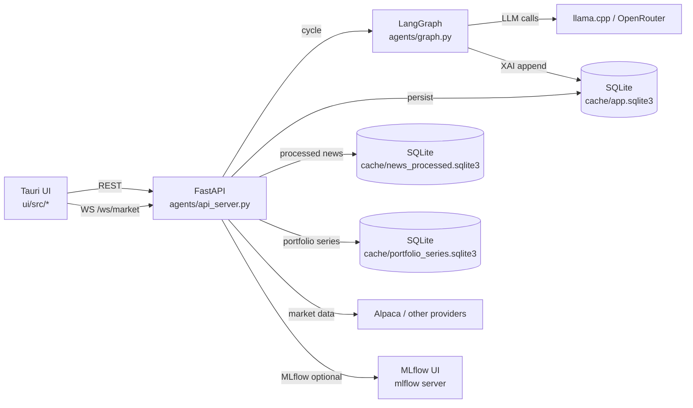
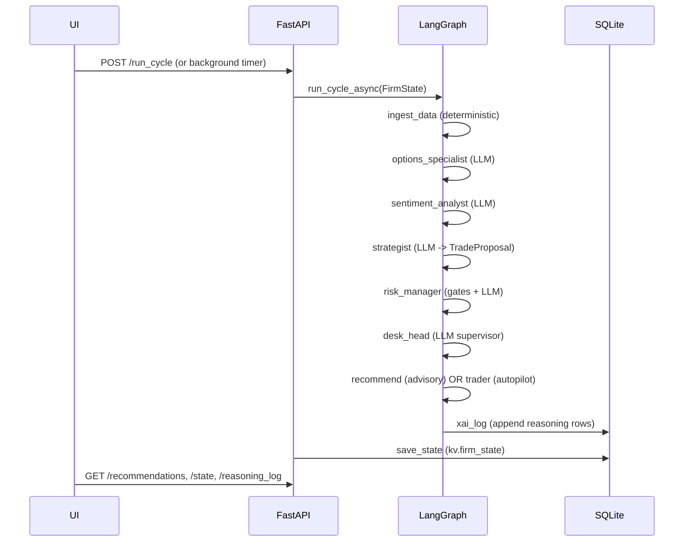

## Architecture

This document answers three questions:

1. **What are the components?** (UI, API server, agent graph, persistence)
2. **How does data move?** (runtime sequence, persistence, APIs)
3. **Where are the hard guardrails?** (expiry/strike filtering, execution gates)

If you want “how a cycle behaves”, read `docs/WORKFLOWS.md`. If you want per-agent contracts, read `docs/AGENTS.md`.

---

### System decomposition

The system is deliberately split into three layers, each with a single responsibility:

- **UI** (`ui/`): render state, accept user intent (ticker change, approve/dismiss), never make trading decisions.
- **API server** (`agents/api_server.py`): owns the runtime `FirmState`, runs background loops, exposes REST/WS endpoints.
- **Agent graph** (`agents/graph.py` + `agents/agents/*`): produces decisions/proposals and appends audit trails.

---

### Architecture diagrams

#### Component diagram (what talks to what)

**Notes**
- `cache/app.sqlite3` is the durable store for **FirmState + XAI log**.
- `cache/news_processed.sqlite3` stores the Tier‑2 processed-news representation.
- MLflow is optional, but when enabled it becomes the easiest way to inspect the “AI flow”.

#### Runtime sequence (one advisory cycle)

---

### Sources of truth (important)

| Concern | Source of truth | Why |
|---|---|---|
| **Account/positions/state at runtime** | In-memory `FirmState` (API server process) | Fast, consistent mutations inside the cycle lock |
| **Durable state across restarts** | SQLite (`cache/app.sqlite3`, `kv.k='firm_state'`) | No large JSON rewrites; incremental + queryable |
| **Selected ticker shown in UI** | UI `activeTicker` | Prevents background drift from silently changing what the user is viewing |

---

### Data flow (high level)

Market/news/background tasks continuously enrich `FirmState`. Periodically (or via `POST /run_cycle`) the agent graph runs against that state and produces:

- a final decision (`trader_decision`)
- possibly a proposal (`pending_proposal`)
- possibly a recommendation (`pending_recommendations` in advisory mode)
- an auditable reasoning trail (append-only XAI)

---

### Runtime loops (backend)

`agents/api_server.py` runs several background loops. Conceptually:

| Loop class | Responsibility | Writes into |
|---|---|---|
| **Market data ingest** | refresh underlying quote + option chain caches | `underlying_price`, `latest_greeks` |
| **News ingest** | pull raw headlines | `news_feed` |
| **Tier loops** | Tier‑1/2 refreshers + Tier‑3 triggers | tier fields, digests, scheduled cycles |
| **Cycle runner** | run `run_cycle_async(FirmState)` under a lock | decisions/proposals/recs/reasoning |
| **Persistence** | `save_state(FirmState)` after cycles and on shutdown | SQLite snapshot |

---

### Key modules (map)

| Area | Module | Notes |
|---|---|---|
| API server | `agents/api_server.py` | background loops + endpoints + cycle lock |
| Graph wiring | `agents/graph.py` | LangGraph nodes + routing + `run_cycle` |
| State schema | `agents/state.py` | Pydantic models (single source of truth) |
| Unified DB | `agents/data/app_db.py` | `cache/app.sqlite3` (`kv`, `xai_log`, `market_event`) |
| State persistence | `agents/state_persistence.py` | stores FirmState JSON into SQLite KV |
| XAI log | `agents/xai/reasoning_log.py` | append-only XAI rows; optional JSONL mirrors |
| Processed news | `agents/data/news_processed_db.py` | SQLite store for enriched articles |
| Portfolio series | `agents/data/portfolio_history_db.py` | durable chart time series |

---

### Persistence model (SQLite-first)

#### Primary store (`cache/app.sqlite3`)

`cache/app.sqlite3` is the durable store for:

- `kv` table: JSON snapshot of FirmState under key `firm_state`
- `xai_log` table: append-only reasoning rows (queryable; low write amplification)
- `market_event` table: optional event capture (debug/replay)

#### MLflow (interactive “agent flow” UI)

If `MLFLOW_TRACKING_URI` is set, each agent cycle is logged to MLflow:

- **Parent run**: one cycle (tags: ticker, trigger, trading_mode)
- **Child runs**: one per step (artifacts: `inputs.json`, `outputs.json`, metrics: duration)
- **LLM call child runs** (`kind=llm_call`): every `invoke_llm` call logs the full prompt
  (`prompt.json`), raw model response (`response.json`), model name, backend (local vs
  OpenRouter), latency (`duration_s`), character counts, and token usage when the provider
  returns it. Set `MLFLOW_LOG_LLM_CALLS=0` to disable, or `MLFLOW_LLM_TEXT_MAX_CHARS` to
  cap persisted prompt/response size (default 40 000).

Implementation:
- `agents/tracking/mlflow_tracing.py` (`start_cycle_run`, `end_cycle_run`, `log_agent_step`, `log_llm_call`)
- `agents/llm_retry.py` (`invoke_llm` wraps every LLM call with MLflow instrumentation)
- Cycle hook: `agents/api_server.py` `_run_one_cycle`
- Step hooks: agent node implementations + `ingest_data`/`recommend` in `agents/graph.py`

#### Legacy migration (one-time)

If a legacy JSON snapshot exists (`agents/_firm_state.json` or `FIRM_STATE_FILE` pointing to `.json`), it is imported **once** into SQLite when the KV store is empty.

#### Boot-time cleanup (expiry)

On startup we remove expired option data from both the *context* and the *queue*:

- remove expired rows from `latest_greeks`
- drop expired option positions from `open_positions`
- clear `pending_proposal` if any leg is expired
- remove recommendations that contain expired legs

#### Optional debug mirrors (off by default)

- XAI JSONL mirror: set `XAI_JSONL=1`
- News processor JSONL mirror: set `NEWS_JSONL=1`
- Market data JSONL mirror: set `MARKET_DATA_JSONL=1`

---

### LLM routing model

- **Local-first** mode uses an OpenAI-compatible llama.cpp server (`LLAMA_LOCAL_BASE_URL`).
- Optional cloud mode can route via OpenRouter when enabled.
- See `docs/CONFIG.md` and the code in:
  - `agents/llm_providers.py`
  - `agents/llm_local.py`
  - `agents/llm_openrouter.py`
  - `agents/llm_retry.py`

---

### Guardrails (options + execution)

#### Options chain filtering

There are two enforcement points; both use the same strike-window helper (`strike_bounds_for_contract`) to keep the UI and agent context consistent.

| Where | Module | What it enforces |
|---|---|---|
| **Agent context** | `agents/data/options_chain_filter.py` | expiry >= today, DTE cap, asymmetric strike windows |
| **UI chain endpoint** | `GET /options/{ticker}` (`agents/api_server.py`) | same windows; spot resolved from `GET /quote/{ticker}` |

#### Execution gating

Execution is deterministic and refusal is explicit:

- expired legs are rejected
- missing quote-derived limit prices are rejected (no blind market orders)

---

### Recommendation lifecycle (high-level)

The “recommendation” is a queue item representing a *proposal the system is willing to execute* once the user approves it.

1. Strategist writes `pending_proposal`.
2. DeskHead writes `trader_decision`.
3. In advisory mode, `recommend_node` appends a `Recommendation`.
4. `POST /recommendations/{id}/approve` validates expiry + quote availability before submission.

---

### Where T1/T2/T3 are documented

The tier model (always-on T1 signals, periodic T2 refreshers, triggered T3 graph) is defined in `agents/tiers.py` and documented in:

- `docs/WORKFLOWS.md` → section **“The tier model (T1 / T2 / T3)”**

