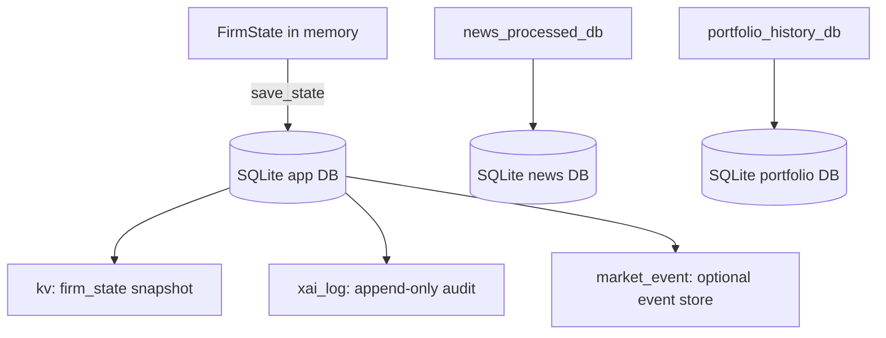

## Workflow designs & methodology

This document is written as an operator-facing spec. It describes *what happens*, *why it happens*,
and *what is guaranteed* by guardrails. If you are debugging a surprising behavior, start here.

It complements:
- `docs/ARCHITECTURE.md` (components + persistence)
- `docs/AGENTS.md` (agent roles)
- `docs/END_TO_END_DRY_RUN.md` (step-by-step dry run example)

---

### Methodology (how we build safe agentic trading)

The system is intentionally opinionated:

1. **Determinism for math and execution**. Anything numeric or safety-critical is code, not LLM.
2. **LLMs for synthesis**. They interpret regimes, narratives, and trade structure, but do not do order math.
3. **Defense-in-depth**. We reject invalid/unsafe proposals in multiple layers (filter → strategist → recommend/approve → trader).
4. **Durability by default**. Persistence is SQLite so state and audit trails survive restarts without latency spikes.
5. **Auditability is non-negotiable**. Every decision is captured as `ReasoningEntry` and persisted to XAI.

---

### Vocabulary

| Term | Meaning |
|---|---|
| **Cycle** | One execution of the LangGraph pipeline on a `FirmState` |
| **Advisory** | System creates recommendations; user approves/dismisses |
| **Autopilot** | System may execute trades automatically |
| **Guardrail** | Deterministic reject/skip logic that prevents unsafe actions |
| **Grounding** | Constraining LLM outputs to symbols/fields that exist in context |

---

## The tier model (T1 / T2 / T3)

This system is **multi-horizon**. Not everything should be “one big LLM call”; most of the time you want
lightweight refresh loops (seconds/minutes/hours) that continuously maintain state, and only occasionally
trigger the full LangGraph pipeline.

The tier system is implemented in `agents/tiers.py` and started from `agents/api_server.py` at startup.

### Tier summary

| Tier | Runs when | Typical cadence | Primary purpose | Writes into `FirmState` |
|---|---|---:|---|---|
| **T1** (always on) | continuously | 30–60s | live desk signals (movement + structured sentiment monitor) | movement fields, sentiment monitor fields, timing/bias |
| **T2** (periodic) | scheduled | minutes → hours | “slow” refreshers (fundamentals + news enrichment) | fundamentals snapshot, news impact map, digests |
| **T3** (triggered) | events or manual | on demand | full LangGraph agent cycle (proposal + decision) | pending proposal/recs + decisions + audit log |

### Tier 1 (T1) — always on

T1 maintains “desk readiness” signals without running the full graph.

**Components**

| Component | Source | What it does | Fields written |
|---|---|---|---|
| SentimentMonitor | `tiers.py` → `sentiment_monitor_llm.py` | LLM synthesizes one desk score from structured Tier‑2 news outputs | `sentiment_monitor_score`, `sentiment_monitor_confidence`, `sentiment_monitor_reasoning`, `sentiment_monitor_source` |
| MovementTracker | `tiers.py` → `agents/agents/movement_tracker.py` | computes movement/anomaly signals from recent bars | `movement_signal`, `movement_anomaly`, `price_change_pct`, `momentum`, `vol_ratio`, `movement_updated` |

### Tier 2 (T2) — periodic

T2 refreshes slower data and produces structured artifacts that keep T3 prompts small and grounded.

**Components**

| Component | Source | What it does | Fields written / storage |
|---|---|---|---|
| FundamentalsRefresher | `tiers.py` (yfinance) | refreshes fundamentals every ~4h; sets change flag when fingerprint changes | `fundamentals`, `fundamentals_updated`, `fundamentals_material_change` |
| NewsProcessor | `tiers.py` → `data/news_processor.py` | LLM enriches headlines and updates cross-stock impacts | `news_impact_map` (plus SQLite in `cache/news_processed.sqlite3`) |

**Note on options chain refresh**

Options chain refresh is **not** a tier loop; it is handled by background tasks in `agents/api_server.py`
(see the 15s ingestion task). T3’s `ingest_data` node then applies the strict chain filter before LLM use.

### Tier 3 (T3) — triggered LangGraph pipeline

T3 is the “expensive” multi-agent reasoning step.

**Triggers**

T3 can be triggered by:

| Trigger | Meaning |
|---|---|
| manual UI | user calls `POST /run_cycle` or clicks a UI control |
| sentiment + movement | high desk sentiment + movement signal |
| technical anomaly | movement anomaly suggests regime change |
| fundamentals change | fingerprint change indicates thesis update |
| scanner | scanner can request a run for a ticker |

T3 respects a cooldown (`T3_COOLDOWN_MINUTES`) to avoid thrashing.

---

## Workflow A — Advisory cycle (news → recommendation)

When `FirmState.trading_mode == "advisory"`, the pipeline generates a **Recommendation**
instead of submitting an order.

```mermaid
flowchart TD
  A[Background tasks\n(news/quotes/options)] --> B[FirmState updated\n(in memory)]
  B --> C[ingest_data (deterministic)\n- spot\n- filter chain\n- compute IV metrics]
  C --> D[options_specialist (LLM)\nanalyst_decision + confidence]
  C --> E[sentiment_analyst (LLM)\naggregate_sentiment + themes]
  D --> F[strategist (LLM)\nTradeProposal or HOLD]
  E --> F
  F --> G[risk_manager (LLM + gates)\nABORT/HOLD/PROCEED]
  G --> H[desk_head (LLM)\ntrader_decision]
  H -->|PROCEED + advisory| I[recommend_node (deterministic)\npark Recommendation]
  H -->|HOLD/ABORT| J[xai_log]
  I --> J[xai_log (persist reasoning + state)]
```

### Contract (what this workflow guarantees)

This workflow guarantees the following, regardless of model behavior:

- LLMs never see expired options if the chain arrives in `latest_greeks` (ingest filter enforces it).
- Strategist proposals are grounded to `near_atm_contracts`.
- Recommendations containing expired legs are never parked.
- Every step appends audit records, and the cycle persists to SQLite.

### Observability (MLflow optional)

If `MLFLOW_TRACKING_URI` is set:

- each **cycle** is a parent MLflow run (`pipeline=tier3`, tags: ticker/trigger/trading_mode)
- each **agent step** is a nested child run with clickable artifacts:
  - `inputs.json`
  - `outputs.json`
  - metrics (`duration_s`, confidence, etc.)

This gives you an interactive UI to follow the chain of decisions without reading logs.

---

## Workflow B — Autopilot execution (proposal → order)

When `FirmState.trading_mode == "autopilot"`, a PROCEED decision triggers deterministic execution.

```mermaid
flowchart TD
  A[pending_proposal exists] --> B[desk_head decides PROCEED]
  B --> C[trader (deterministic)\nvalidate + build order legs]
  C -->|missing quotes| D[reject (no blind market orders)]
  C -->|expired leg| E[reject]
  C -->|ok| F[EMS.submit order]
  F --> G[post-order sync\npositions/account]
  D --> H[xai_log]
  E --> H
  G --> H[xai_log]
```

### Contract

- Orders are always **limit orders** (mid derived from bid/ask).
- If any leg has no quote-derived mid, execution is blocked.
- Expired symbols are rejected before order build/submit.

---

## Workflow C — Options chain filtering (agent + UI consistency)

The project uses the same strike-window logic in:
- agent context filtering (`filter_greeks_for_agents`)
- UI chain endpoint (`GET /options/{ticker}`)

```mermaid
flowchart LR
  A[Raw chain snapshots\n(provider)] --> B[Expiry parse\nYYMMDD / YYYYMMDD / YYYY-MM-DD]
  B --> C{expiry < today?}
  C -->|yes| X[drop]
  C -->|no| D{DTE > max?}
  D -->|yes| X
  D -->|no| E[strike bounds\nCALL: spot → spot*(1+band)\nPUT: spot*(1-band) → spot]
  E --> F{strike in bounds?}
  F -->|no| X
  F -->|yes| G[keep]
```

### Why asymmetric strike windows?

Because “±50% around spot” is not what traders mean by “calls from spot up to +50%”. The asymmetric window:

- removes deep ITM calls when the user expects spot→upside only
- keeps context smaller and the chain closer to actionable contracts

### Spot resolution requirement

Strike filtering only works if spot is known. The UI chain endpoint resolves spot from `GET /quote/{ticker}` first; if providers are down, it falls back to cached estimates.

---

## Workflow D — Persistence & durability (SQLite-first)



### Contract

- Writes are incremental (append or KV update), avoiding large JSON rewrites.
- Legacy JSON snapshots migrate once (if present).
- Boot-time cleanup purges expired option data from persisted state.

---

## Workflow E — Failure modes & recovery

Common failures are handled explicitly:

- **LLM down / timeout**
  - Cycle can still run deterministic ingest + update UI state
  - Reasoning log includes `SYSTEM/ERROR` via `log_cycle_failure`

- **Missing option quotes**
  - Execution is blocked (no blind market orders)
  - Recommendation UI shows `missing_quotes`

- **Expired legs in stored history**
  - Purged on startup (greeks/positions) and removed from pending recommendations

---

### Operating methodology (how to run it safely)

- **Default to advisory** until the strategy set + data quality is stable.
- Use `MAX_POSITION_PCT`, drawdown caps, and the kill switch as the first line of defense.
- Treat “missing quotes” and “expired legs” as data-quality failures:
  - dismiss + regenerate recommendations
  - verify chain provider (Alpaca feed/subscription)
  - confirm spot resolution (`/quote/{ticker}`) is healthy

### Debug checklist (fast)

---

---

## Workflow specs (implementation-oriented)

This section gives “proper” workflow specs: trigger → inputs → steps → outputs.

#### Spec A — Advisory recommendation cycle

- **Trigger**
  - Background Tier-3 watchdog OR `POST /run_cycle`
- **Primary inputs**
  - `FirmState` (ticker, spot, filtered option chain, news digests, risk metrics)
  - LLM backends configured in `.env`
- **Steps**
  1. `ingest_data`: compute deterministic features; filter chain.
  2. `options_specialist`: interpret IV structure.
  3. `sentiment_analyst`: analyze recent headlines.
  4. `bull_researcher` / `bear_researcher` (optional): conviction arguments.
  5. `strategist`: produce `pending_proposal` (or HOLD).
  6. `risk_manager`: gates + soft assessment.
  7. `desk_head`: final `trader_decision`.
  8. If `trading_mode=="advisory"` and decision is PROCEED → `recommend_node`.
  9. `xai_log`: persist reasoning; persist state snapshot.
- **Outputs**
  - `pending_recommendations` appended with a `Recommendation`
  - persisted in SQLite (`kv.firm_state`, `xai_log`)
  - UI reads via `GET /recommendations`

#### Spec B — Approve recommendation (execution path)

- **Trigger**
  - User clicks **Approve** in UI → `POST /recommendations/{id}/approve`
- **Steps**
  1. Validate legs are **not expired**.
  2. Build legs with deterministic mid pricing.
  3. If quotes missing: attempt targeted quote prewarm; retry once.
  4. Submit to EMS.
  5. Persist state + append `ReasoningEntry`.
- **Outputs**
  - order submission result
  - persisted audit trail (XAI + state)

#### Spec C — UI options chain refresh

- **Trigger**
  - User switches ticker in UI OR the UI prefetch warms cache.
- **Steps**
  1. UI calls `GET /options/{ticker}`.
  2. Backend resolves spot from `GET /quote/{ticker}` (preferred).
  3. Backend filters chain by expiry + strike windows.
  4. UI renders chain and applies *view filters* (calls/puts/strike search) locally.
- **Output**
  - options table always matches the UI-selected ticker (no backend ticker overwrite).

- **Options chain looks wrong**:
  - Check `GET /quote/{ticker}` returns a live `last` (spot).
  - Check `GET /options/{ticker}` strike ranges align with spot (calls: spot→1.5×, puts: 0.5×→spot by default).
- **Recommendations show missing bid/ask**:
  - Confirm the OCC symbols are not expired.
  - Confirm `FirmState.latest_greeks` contains those symbols (UI uses it for pricing).
- **Ticker desync in UI**:
  - UI ticker is source of truth; backend ticker may drift due to other tasks.
  - If you see a mismatch, reload UI and ensure only one window is driving ticker changes.

